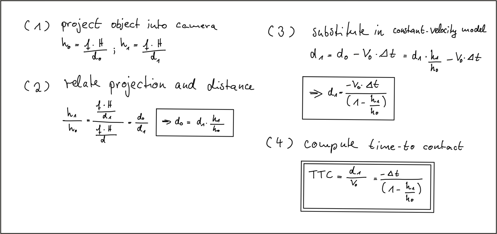

# SFND 3D Object Tracking

Welcome to the final project of the camera course. By completing all the lessons, you now have a solid understanding of keypoint detectors, descriptors, and methods to match them between successive images. Also, you know how to detect objects in an image using the YOLO deep-learning framework. And finally, you know how to associate regions in a camera image with Lidar points in 3D space. Let's take a look at our program schematic to see what we already have accomplished and what's still missing.

In this final project, you will implement the missing parts in the schematic. To do this, you will complete four major tasks: 
1. First, you will develop a way to match 3D objects over time by using keypoint correspondences. 
2. Second, you will compute the TTC based on Lidar measurements. 
3. You will then proceed to do the same using the camera, which requires to first associate keypoint matches to regions of interest and then to compute the TTC based on those matches. 
4. And lastly, you will conduct various tests with the framework. Your goal is to identify the most suitable detector/descriptor combination for TTC estimation and also to search for problems that can lead to faulty measurements by the camera or Lidar sensor. In the last course of this Nanodegree, you will learn about the Kalman filter, which is a great way to combine the two independent TTC measurements into an improved version which is much more reliable than a single sensor alone can be. But before we think about such things, let us focus on your final project in the camera course. 

## Dependencies for Running Locally
* cmake >= 2.8
  * All OSes: [click here for installation instructions](https://cmake.org/install/)
* make >= 4.1 (Linux, Mac), 3.81 (Windows)
  * Linux: make is installed by default on most Linux distros
  * Mac: [install Xcode command line tools to get make](https://developer.apple.com/xcode/features/)
  * Windows: [Click here for installation instructions](http://gnuwin32.sourceforge.net/packages/make.htm)
* OpenCV >= 4.1
  * This must be compiled from source using the `-D OPENCV_ENABLE_NONFREE=ON` cmake flag for testing the SIFT and SURF detectors.
  * The OpenCV 4.1.0 source code can be found [here](https://github.com/opencv/opencv/tree/4.1.0)
* gcc/g++ >= 5.4
  * Linux: gcc / g++ is installed by default on most Linux distros
  * Mac: same deal as make - [install Xcode command line tools](https://developer.apple.com/xcode/features/)
  * Windows: recommend using [MinGW](http://www.mingw.org/)

## Basic Build Instructions

1. Clone this repo.
2. Make a build directory in the top level project directory: `mkdir build && cd build`
3. Compile: `cmake .. && make`
4. Run it: `./3D_object_tracking`.

## Rubric

1. Implement the method "matchBoundingBoxes", which takes as input both the previous and the current data frames and provides as output the ids of the matched regions of interest (i.e. the boxID property). Matches must be the ones with the highest number of keypoint correspondences.

   

   >In "matchBoundingBoxes" function, we iterate all of the matches between previous and current data frame, then we are able to extract corresponding key-points in both previous and current frames based on these matches. Let's assume the key-points pair is (prevKeyPoint, currKeyPoint). So when we try to match previous bounding boxes to current bounding boxes, we check if the previous bounding box contains prevKeyPoint and current bounding box contains currKeyPoint at the same time. If so, the count number of total matches between previous bounding box ID and current bounding box ID will be accumulated(+1). At the end of inner loop, we choose the match with max count number, or in other words the match has highest number of key-point correspondences, as the final match between previous and current bounding box ID. Then we keep iterating until we find all matches.

   

2. Compute the time-to-collision in second for all matched 3D objects using only Lidar measurements from the matched bounding boxes between current and previous frame.

   

   

   

   

   

   >We can compute LiDAR based TTC from following equation above. So in order to compute the TTC, we need to find the distance to the closest LiDAR point in the path of driving,  which is located on the tailgate of the preceding vehicle. Even though LiDAR is a reliable sensor, erroneous measurements may still occur. As seen in the figure below, a small number of points is located behind the tailgate, seemingly without connection to the vehicle. 

   

   

   >In order to filter out these outliers, we implement K-D tree and euclidean cluster in this project. Basically we use all of the projected points to build the K-D tree, and clustering all of the points based on their euclidean distance. Points with large gap (euclidean distance more than certain threshold) will be clustered into separate clusters. And we will only choose the cluster with maximum size to calculate LiDAR based TTC. This is one of the are ways to avoid such errors by post-processing the point cloud, but there will be no guarantee that such problems will never occur in practice.
   >
   >This part is implemented in "removeLidarOutlier" and "euclideanCluster" function.

   

3. Prepare the TTC computation based on camera measurements by associating keypoint correspondences to the bounding boxes which enclose them. All matches which satisfy this condition must be added to a vector in the respective bounding box.

   

   > In "clusterKptMatchesWithROI" function, we associate a given bounding box with the keypoints it contains. We iterate all of the key-point matches, and if the key-point can be found in the region of interest of our current bounding box, we will save current match to corresponding bounding box structure for calculating the camera based TTC.

   ​		

4. Compute the time-to-collision in second for all matched 3D objects using only keypoint correspondences from the matched bounding boxes between current and previous frame.

   

   

   

   

   

   > We can measure the time to collision by observing relative height change on the image sensor. However when observed closely however, it can be seen that the bounding boxes do not always reflect the true vehicle dimensions and the aspect ratio differs between images. Using bounding box height or width for TTC computation would thus lead to significant estimation errors.

   

   

   ​	

   

   

   > Instead of relying on the detection of the vehicle as a whole we now want to analyze its structure on a smaller scale. If were possible to locate uniquely identifiable keypoints that could be tracked from one frame to the next, we could use the distance between all keypoints on the vehicle relative to each other to compute a robust estimate of the height ratio in out TTC equation.
   >
   > The ratio of all relative distances between each other can be used to compute a reliable TTC estimate by replacing the height ratio h1 / h0 with the mean or median of all distance ratios dk / dk'.
   >
   > However,  computing the mean distance ratio as in the function we just discussed would presumably lead to a faulty calculation of the TTC. A more robust way of computing the average of a dataset with outliers is to use the median instead. 
   >
   > This part is implemented in "computeTTCCamera" function.

   

5. Find examples where the TTC estimate of the Lidar sensor does not seem plausible. Describe your observations and provide a sound argumentation why you think this happened. If if were possible to locate uniquely identifiable keypoints that could be tracked from one frame to the next, we could use the distance between all keypoints on the vehicle relative to each other to compute a robust estimate of the height ratio in out TTC equation.

   

   [Performance Evaluation 1 - LiDAR based TTC](#benchmark)

   

6. Run several detector / descriptor combinations and look at the differences in TTC estimation. Find out which methods perform best and also include several examples where camera-based TTC estimation is way off. As with Lidar, describe your observations again and also look into potential reasons.

   

   [Performance Evaluation 2 - Camera based TTC](#benchmark)

## Benchmark

#### LiDAR Based TTC

#### Camera Based TTC

| Detectors\Descriptors | BRISK |  BRIEF  |      ORB      | FREAK | AKAZE | SIFT |
| :-------------------: | :---: | :-----: | :-----------: | :---: | :---: | :--: |
|       SHITOMASI       |  347  | **413** |      398      |  341  |  N/A  | 405  |
|        HARRIS         |  141  |   206   |      162      |  144  |  N/A  | 163  |
|         FAST          |  281  |   336   |      332      |  295  |  N/A  | 291  |
|         BRISK         |  276  |   314   |      266      |  292  |  N/A  | 279  |
|          ORB          |  339  |   267   |      347      |  327  |  N/A  | 364  |
|         AKAZE         |  349  |   392   |      345      |  353  |  343  | 348  |
|         SIFT          |  201  |   249   | Out of Memory |  195  |  N/A  | 294  |

